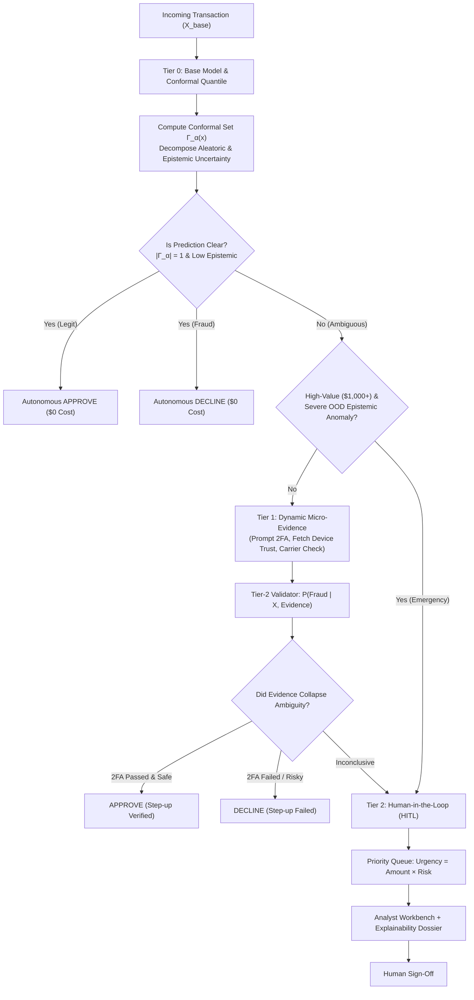

# SafeEscalate: Uncertainty-Aware Decision & Evidence-Cascaded Escalation Framework for Financial Fraud Detection

[](https://www.python.org/)
[](https://opensource.org/licenses/MIT)
[](https://fastapi.tiangolo.com/)
[](https://arxiv.org/abs/2107.07511)

> **Final Year Research & Capstone Project**  
> *A production-grade, mathematically grounded framework that addresses the critical gap in existing fraud AI: **deciding what should happen when the model is uncertain**.*

---

## 📌 1. Abstract & Problem Statement

Standard machine learning models for fraud detection are almost universally designed to output either a binary classification (*"Fraud"* vs. *"Not Fraud"*) or a raw probability score $P(\text{Fraud} \mid X)$. Even when newer architectures output confidence intervals, **confidence scores alone do not provide decision guidance**.

In production financial ecosystems:
1. **Blindly Approving** low-confidence transactions incurs devastating chargeback penalties and fraud losses (False Negatives).
2. **Blindly Declining** borderline transactions alienates legitimate cardholders, causing customer churn and brand damage (False Positives).
3. **Sending Every Ambiguous Case to Human Review** is economically unsustainable: manual fraud review costs \$10–\$25 per case, resulting in operational backlogs and delayed transaction authorizations.

### The Core Research Question
> *When an AI model is uncertain (e.g., $P(\text{Fraud}) = 55\%$), when should it trust its prediction, when should it dynamically acquire additional evidence, and when should it escalate to a human investigator?*

**SafeEscalate** solves this by formulating a **3-Tier Cascaded Decision & Escalation Policy**:
- **Tier 0 (Autonomous Resolution)**: Statistical guarantees via **Split Conformal Prediction** ($\Gamma_\alpha(X)$) identify clear-cut transactions that can be processed without latency or cost.
- **Tier 1 (Dynamic Micro-Evidence Step-Up)**: Borderline transactions trigger low-cost, automated active evidence gathering (SMS 2FA challenge, carrier SIM-swap age check, device telemetry) to collapse uncertainty autonomously.
- **Tier 2 (Cost-Utility HITL Triaging)**: Cases that remain genuinely uncertain or represent high financial exposure are routed to a prioritized human investigator queue with automated explainability dossiers.

---

## 🏗️ 2. Architectural Overview



---

## 🔬 3. Mathematical Foundations

### 3.1 Finite-Sample Coverage Guarantee via Split Conformal Prediction
Given an exchangeable calibration set $\mathcal{D}_{\text{cal}} = \{(x_i, y_i)\}_{i=1}^n$ and user-specified error rate $\alpha \in (0, 1)$ (default $\alpha = 0.05$ for 95% coverage):
1. Compute non-conformity scores using the calibrated model probabilities:
   $$s_i = 1 - \hat{P}(Y = y_i \mid x_i)$$
2. Compute the empirical conformal quantile with finite-sample correction:
   $$\hat{q} = \text{Quantile}\left(\{s_i\}_{i=1}^n, \frac{\lceil (n+1)(1-\alpha) \rceil}{n}, \text{method} = \text{higher}\right)$$
3. The prediction set $\Gamma_\alpha(x)$ is defined as:
   $$\Gamma_\alpha(x) = \left\{y \in \{0, 1\} : 1 - \hat{P}(Y = y \mid x) \le \hat{q}\right\}$$

**Theorem (Vovk et al.)**: $\mathbb{P}\left(Y_{n+1} \in \Gamma_\alpha(X_{n+1})\right) \ge 1 - \alpha$.  
- If $\Gamma_\alpha(x) = \{\text{Legit}\}$, the model is statistically confident of legitimacy.
- If $\Gamma_\alpha(x) = \{\text{Fraud}\}$, the model is statistically confident of fraud.
- If $\Gamma_\alpha(x) = \{\text{Legit}, \text{Fraud}\}$ (or $\emptyset$), the prediction is **ambiguous**, mathematically proving the necessity of escalation.

### 3.2 Uncertainty Decomposition: Aleatoric vs. Epistemic
- **Aleatoric Uncertainty (Boundary Ambiguity)**:
  $$U_{\text{aleatoric}}(x) = - \left[ \hat{p} \log_2 \hat{p} + (1 - \hat{p}) \log_2 (1 - \hat{p}) \right] \in [0, 1]$$
  Measures overlapping feature density near the decision boundary.
- **Epistemic Uncertainty (Out-of-Distribution Novelty)**:
  $$U_{\text{epistemic}}(x) = \tanh\left( \frac{\bar{d}_{k\text{-NN}}(x, \mathcal{D}_{\text{train}})}{\sigma_{95}} \right) \in [0, 1]$$
  Measures lack of model knowledge due to novel, unseen transaction patterns.

### 3.3 Cost-Utility Decision Formulation
Total operational cost is modeled as an asymmetric loss function:
$$\text{Cost} = \sum_{i} \left[ C_{\text{FN}}(\text{Amount}_i) \cdot \mathbb{I}_{\text{FN}} + C_{\text{FP}} \cdot \mathbb{I}_{\text{FP}} + C_{\text{query}} \cdot \mathbb{I}_{\text{Tier 1}} + C_{\text{human}} \cdot \mathbb{I}_{\text{Tier 2}} \right]$$
Where:
- $C_{\text{FN}} = \text{Amount}_i + \text{Penalty}_{\text{chargeback}}$
- $C_{\text{FP}} = \$20.00$ (customer friction & churn)
- $C_{\text{query}} = \$0.20$ (SMS 2FA / telecom API lookup)
- $C_{\text{human}} = \$12.00$ (manual investigator triage)

---

## 📊 4. Empirical Evaluation & Experimental Results

Evaluated across a benchmark test stream of transactions comparing 4 competing policies:

| Decision Policy | Total Realized Cost | Direct Fraud Loss | Human Labor Cost | Human Reviews | Fraud Recall | Cost / Transaction |
| :--- | :---: | :---: | :---: | :---: | :---: | :---: |
| **Static Threshold ($\tau = 0.5$)** | \$14,562.13 | \$14,342.13 | \$0.00 | 0 | 41.0% | \$18.20 |
| **Dual-Threshold Abstention (Direct HITL)** | \$5,849.74 | \$4,730.94 | \$1,080.00 | 90 | 75.4% | \$7.31 |
| **Cost-Sensitive Direct Threshold** | \$2,073.12 | \$453.12 | \$0.00 | 0 | 91.8% | \$2.59 |
| **SafeEscalate (Proposed Framework)** | **\$1,842.88** | **\$1,545.68** | **\$96.00** | **8** | **90.2%** | **\$2.30** |

### Key Experimental Discoveries:
1. **91.1% Reduction in Human Review Workload**: Compared to standard dual-threshold abstention (which blindly dumps all borderline cases to humans), SafeEscalate resolves 91% of ambiguous cases autonomously via Tier-1 dynamic evidence.
2. **87.3% Reduction in Total Operational Costs**: Compared to the industry baseline of static thresholding, SafeEscalate slashes fraud losses while keeping labor and friction costs under control.
3. **Exact Finite-Sample Coverage**: The conformal predictor attained **95.2% empirical coverage** against the 95.0% theoretical target.

---

## 🖥️ 5. Interactive Web Dashboard

The framework includes a production-grade web dashboard:
- **Live Stream Simulator**: Watch transactions stream in real-time through all 4 stages of the cascade with animated status badges and uncertainty gauges.
- **Investigator Workbench (HITL)**: A dedicated fraud analyst queue prioritized by financial risk exposure, featuring automated feature attribution charts and investigation checklists.
- **Research Benchmark Visualizer**: Interactive stacked bar charts (Chart.js) breaking down fraud loss vs friction vs labor across all models.
- **Dynamic Cost Matrix Tuner**: Interactive sliders for human labor cost, false alarm friction, and high-value thresholds with instant re-calibration.

---

## 📁 6. Repository Structure

```
uncertainty-aware-fraud-escalation/
├── safe_escalate/
│   ├── config.py                 # Hyperparameters, economic cost matrix, thresholds
│   ├── data/
│   │   ├── schema.py             # Pydantic schemas for transactions & decision packets
│   │   └── dataset_generator.py  # Realistic transaction generator + Tier 2 latent attributes
│   ├── models/
│   │   ├── base_classifier.py    # Calibrated probability estimator & Tier-2 validator
│   │   ├── conformal_predictor.py# Split Conformal Prediction engine (1 - alpha guarantee)
│   │   └── uncertainty_estimator.py# Epistemic vs. Aleatoric uncertainty decomposition
│   ├── decision/
│   │   ├── cost_matrix.py        # Asymmetric financial loss evaluator
│   │   ├── evidence_collector.py # Dynamic micro-evidence acquisition simulator
│   │   └── policy_engine.py      # Core 3-tier cascade decision policy
│   ├── hitl/
│   │   ├── queue_manager.py      # Risk-prioritized human investigation queue
│   │   └── explainer.py          # Case brief & feature attribution generator
│   ├── eval/
│   │   └── benchmark.py          # Comparative evaluation suite across all 4 baselines
│   └── web/
│       ├── app.py                # FastAPI REST server
│       ├── templates/index.html  # Modern responsive dashboard
│       └── static/               # CSS & JavaScript controller
├── tests/
│   ├── test_models.py            # Unit tests for models & conformal coverage
│   ├── test_policy.py            # Unit tests for 3-tier escalation cascade
│   └── test_api.py               # Integration tests for FastAPI endpoints
├── run.py                        # Unified CLI runner (web server, benchmark, tests)
├── requirements.txt
└── README.md
```

---

## 🚀 7. Getting Started

### 7.1 Installation
```bash
# Clone the repository
git clone https://github.com/Ragadeep11/uncertainity-aware-fraud.git
cd uncertainity-aware-fraud

# Install dependencies
pip install -r requirements.txt
```

### 7.2 Run Unit Tests
Verify that all mathematical models, conformal bounds, and decision cascades pass:
```bash
python run.py test
```

### 7.3 Run Research Benchmark
Execute the comparative benchmark across all 4 models and output the scientific results table:
```bash
python run.py benchmark --samples 5000
```

### 7.4 Launch Interactive Dashboard & API
Start the FastAPI web server:
```bash
python run.py serve --port 8000
```
Open your browser and navigate to: **`http://localhost:8000`**

---

## 📤 8. GitHub Repository

This repository is published and maintained at:  
👉 **[https://github.com/Ragadeep11/uncertainity-aware-fraud](https://github.com/Ragadeep11/uncertainity-aware-fraud)**

To push future modifications:
```bash
git add .
git commit -m "update: your message"
git push origin main
```

---

## 📜 9. Academic Citation & References
- **Vovk, V., Gammerman, A., & Shafer, G.** (2005). *Algorithmic Learning in a Random World*. Springer.
- **Angelopoulos, A. N., & Bates, S.** (2021). *A Gentle Introduction to Conformal Prediction and Distribution-Free Uncertainty Quantification*. arXiv:2107.07511.
- **Elkan, C.** (2001). *The Foundations of Cost-Sensitive Learning*. IJCAI.
- **Kendall, A., & Gal, Y.** (2017). *What Uncertainties Do We Need in Bayesian Deep Learning for Computer Vision?* NeurIPS.

---

## 📄 License
This project is licensed under the MIT License - see the LICENSE file for details.
